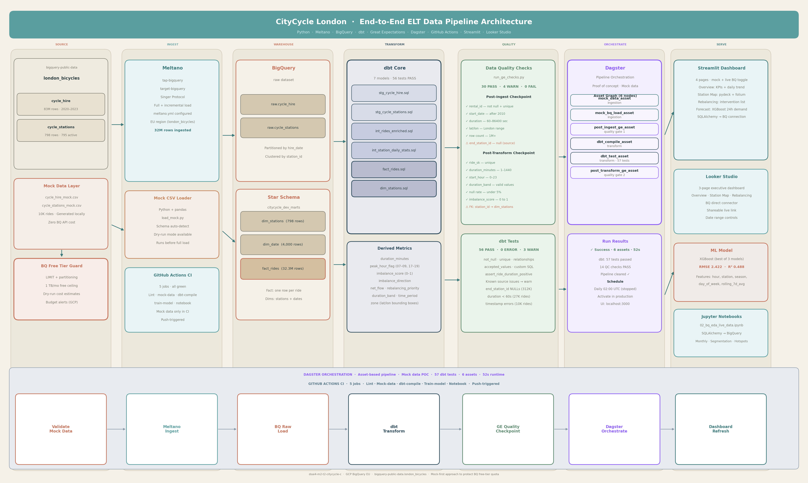

# 🚲 CityCycle London — Bike Rebalancing Intelligence Pipeline

> **dsai4-m2-t2-citycycle-c**  
> End-to-end ELT pipeline for the London Bicycle Sharing dataset, built for the CityCycle operations team to solve the bike rebalancing problem using data engineering, ML forecasting, and interactive dashboards.

---

## Table of Contents

1. [Business Problem](#business-problem)
2. [Solution Overview](#solution-overview)
3. [Architecture](#architecture)
4. [Tech Stack](#tech-stack)
5. [Repository Structure](#repository-structure)
6. [Getting Started](#getting-started)
7. [Mock Data Strategy (Free Tier Protection)](#mock-data-strategy)
8. [Pipeline Walkthrough](#pipeline-walkthrough)
   - [1. Ingestion (Meltano)](#1-ingestion-meltano)
   - [2. Data Warehouse Design (BigQuery Star Schema)](#2-data-warehouse-design)
   - [3. ELT Transformation (dbt)](#3-elt-transformation-dbt)
   - [4. Data Quality (Great Expectations)](#4-data-quality-great-expectations)
   - [5. Analysis & ML (Python / scikit-learn)](#5-analysis--ml)
   - [6. Orchestration (GitHub Actions CI)](#6-orchestration-github-actions-ci)
   - [7. Dashboards (Streamlit + Looker Studio)](#7-dashboards)
9. [Key Findings (Mock Data)](#key-findings-mock-data)
10. [Risks & Mitigations](#risks--mitigations)
11. [Contributing](#contributing)

---

## Business Problem

London's CityCycle bike-sharing network operates **795 docking stations** across the city, processing millions of rides annually. The core operational challenge is **bike rebalancing**: stations run empty (stranded demand) or overflow (no docks to return), leading to:

- **Lost revenue** from unfulfilled rentals
- **Increased operational costs** for manual rebalancing crews
- **Poor customer experience** and negative NPS
- **Inefficient fleet utilisation** across the network

**Goal:** Build an intelligent, data-driven pipeline that ingests ride history, detects imbalance patterns, forecasts demand per station, and visualises actionable rebalancing recommendations in near real-time.

---

## Solution Overview

```
BigQuery Public Data → Meltano Ingest → BQ Raw → dbt Transform
→ Great Expectations Quality Gate → ML Demand Forecast
→ Streamlit Dashboard + Looker Studio Report
(CI/CD orchestrated by GitHub Actions · 5 jobs · push-triggered)
```

---

## Architecture



The pipeline follows a **medallion-style** architecture:
- **Bronze** (`raw.*`): Raw tables ingested from BigQuery public dataset via Meltano
- **Silver** (`staging.*`): Cleaned, typed, validated tables via dbt staging models
- **Gold** (`marts.*`): Star schema fact/dimension tables for analytics and ML

---

## Tech Stack

| Layer | Tool | Purpose |
|-------|------|---------|
| Ingestion | **Meltano** (tap-bigquery → target-bigquery) | Singer-protocol EL from source to raw |
| Warehouse | **Google BigQuery** | Cloud data warehouse, star schema |
| Transform | **dbt Core** | SQL-based ELT, lineage, testing |
| Quality | **Great Expectations** | Expectation suites, checkpoints, data docs |
| Analysis | **Python / pandas / scikit-learn** | EDA, feature engineering, ML |
| Dashboard | **Streamlit** | Interactive ops dashboard + geospatial map |
| BI Reporting | **Looker Studio** | Executive KPI report (BQ connector) |

---

## Repository Structure

```
dsai4-m2-t2-citycycle-c/
├── .github/
│   └── workflows/
│       └── ci.yml                    # GitHub Actions: lint, mock-data, dbt-compile, train-model, notebook
├── ingestion/
│   ├── meltano.yml                   # Meltano project config (tap-bigquery → target-bigquery)
│   ├── load_mock.py                  # Python loader: mock CSV → BigQuery (dry-run + live)
│   ├── load_live_stations.py         # One-time loader: stations from BQ public dataset
│   └── bq_cost_guard.py              # Query cost guard: dry-run estimates + monthly budget tracking
├── transform/
│   ├── dbt_project.yml               # dbt project config
│   ├── profiles_template.yml         # profiles.yml template (DO NOT commit real profiles.yml)
│   ├── models/
│   │   ├── staging/
│   │   │   ├── stg_cycle_hire.sql    # Clean + type raw ride data
│   │   │   ├── stg_cycle_stations.sql # Clean stations, add zone + capacity_tier
│   │   │   └── _staging.yml          # 25 schema tests
│   │   ├── intermediate/
│   │   │   ├── int_rides_enriched.sql        # Join rides + stations, add flags
│   │   │   └── int_station_daily_stats.sql   # Daily imbalance per station
│   │   └── marts/
│   │       ├── dim_stations.sql      # Station dimension with rebalancing priority
│   │       ├── dim_date.sql          # Date spine 2010–2030
│   │       ├── fact_rides.sql        # 32.3M rows, partitioned by hire_date
│   │       └── _marts.yml            # 31 schema tests
│   ├── macros/
│   │   └── generate_surrogate_key.sql
│   └── tests/
│       └── assert_ride_duration_positive.sql
├── quality/
│   ├── checkpoints/
│   │   └── post_ingest.yml           # GE checkpoint config
│   ├── expectations/
│   │   └── suites/
│   │       ├── raw_cycle_hire.json
│   │       └── fact_rides.json
│   ├── run_ge_checks.py              # 34 custom SQL checks: 30 PASS · 4 WARN · 0 FAIL
│   └── ge_results.json               # Last run results (evidence)
├── orchestration/
│   ├── workspace.yaml                # Dagster scaffold (reference only — CI uses GitHub Actions)
│   ├── assets/
│   │   ├── ingestion_assets.py
│   │   ├── transform_assets.py
│   │   └── quality_assets.py
│   └── jobs/
│       └── citycycle_pipeline_job.py
├── analysis/
│   └── notebooks/
│       ├── 01_eda_mock_data.ipynb           # Initial EDA on mock data
│       └── 02_bq_eda_live_data.ipynb        # Live BQ EDA via SQLAlchemy (32M rows)
├── ml/
│   └── models/
│       └── train_demand_model.py     # 3-model comparison: Linear Reg · Random Forest · XGBoost
├── dashboard/
│   ├── app.py                        # Streamlit entry point
│   ├── pages/
│   │   ├── 01_overview.py            # KPIs + daily trend + hourly demand
│   │   ├── 02_station_map.py         # pydeck 3D + folium detailed map
│   │   ├── 03_rebalancing.py         # Intervention list + crew runs estimate
│   │   └── 04_forecast.py            # 24h XGBoost demand forecast
│   └── utils/
│       ├── bq_client.py              # BQ connection via cost guard
│       └── mock_data_generator.py    # Synthetic data generator (CI-safe)
├── data/
│   └── mock/
│       ├── cycle_hire_mock.csv       # 10K synthetic rides (CI + dev)
│       └── cycle_stations_mock.csv   # 795 station records
├── docs/
│   └── diagrams/
│       └── dataflow_diagram.png      # Architecture diagram
├── .env.example                      # Template for env vars (no secrets)
├── .gitignore
├── requirements.txt
└── README.md
```

---

## Getting Started

### Prerequisites

- Python 3.10+
- Google Cloud account with BigQuery access
- `gcloud` CLI authenticated
- Node.js 18+ (for pptxgenjs, optional)

### 1. Clone & Install

```bash
git clone https://github.com/YOUR_ORG/dsai4-m2-t2-citycycle-c.git
cd dsai4-m2-t2-citycycle-c

python -m venv .venv && source .venv/bin/activate
pip install -r requirements.txt
```

### 2. Configure Environment

```bash
cp .env.example .env
# Edit .env — add your GCP project ID, BQ dataset names, etc.
# NEVER commit .env to Git
```

### 3. Run with Mock Data First (Recommended)

Before touching BigQuery's live data, validate the full pipeline with local mock data:

```bash
# Generate mock data
python dashboard/utils/mock_data_generator.py

# Load mock CSV into BigQuery (raw schema)
python ingestion/load_mock.py --mode=mock

# Run dbt transformations
cd transform && dbt run --target dev

# Run quality checks
python quality/run_ge_checks.py

# Launch dashboard
streamlit run dashboard/app.py
```

### 4. Run Full Pipeline (Real Data)

Once validated on mock data, switch to live ingestion:

```bash
# Meltano ingest from BQ public dataset
cd ingestion && meltano run tap-bigquery target-bigquery

# Then continue with dbt + GE as above

# See .github/workflows/ci.yml for the full CI pipeline
```

---

## Mock Data Strategy

### Why Mock Data First?

BigQuery's free tier provides **1 TB of query processing per month**. The `cycle_hire` table has **83 million rows**. A single unguarded `SELECT *` could consume the entire monthly quota instantly.

### Our Approach

| Risk | Mitigation |
|------|-----------|
| Full-table scan on `cycle_hire` | `LIMIT` clauses on all dev queries; partitioned by `hire_date` |
| Accidental `SELECT *` | dbt `+limit` macro in dev profile; BQ slot quota set |
| Exceeding 1 TB free tier | Dry-run cost estimates before every query; budget alert at 80% |
| Development iteration cost | All development runs against `data/mock/` CSV files |
| CI/CD test cost | GitHub Actions uses mock data only; no live BQ calls in CI |

### Mock Data Schema

The mock data mirrors the exact schema of the public BigQuery tables:

```
cycle_hire_mock.csv    → bike_id, rental_id, duration, start_date,
                         start_station_id, start_station_name,
                         end_date, end_station_id, end_station_name
cycle_stations_mock.csv → id, install_date, installed, latitude,
                          locked, longitude, name, nbdocks,
                          temporary, terminal_name
```

---

## Pipeline Walkthrough

### 1. Ingestion (Meltano)

Meltano uses the **Singer protocol** (tap → target) to extract data from BigQuery and load it into the raw dataset.

- **tap-bigquery**: Reads from `bigquery-public-data.london_bicycles`
- **target-bigquery**: Writes to your project's `raw` dataset
- Supports full refresh and incremental loads (state-based on `start_date`)

```bash
meltano run tap-bigquery target-bigquery
```

### 2. Data Warehouse Design

Star schema optimised for ride analytics and rebalancing queries:

**Fact Table:**
- `fact_rides` — one row per ride: duration, start/end station FK, date FK, hour, day-of-week

**Dimension Tables:**
- `dim_stations` — station metadata: name, location (lat/lon), dock capacity, zone
- `dim_date` — date spine: year, month, week, is_weekend, is_holiday (UK bank holidays)
- `dim_duration` — banded ride durations (short/medium/long/extended)

### 3. ELT Transformation (dbt)

```
raw.cycle_hire
    └── stg_cycle_hire        (cast types, rename columns, parse timestamps)
        └── int_rides_enriched (join stations, add peak_hour_flag, duration_band)
            └── fact_rides     (final fact table, add is_station_imbalanced flag)

raw.cycle_stations
    └── stg_cycle_stations    (clean nulls, add zone via lat/lon lookup)
        └── dim_stations       (final dimension, add capacity_tier)
```

Derived columns generated in dbt:
- `ride_duration_minutes` — `TIMESTAMP_DIFF(end_date, start_date, MINUTE)`
- `peak_hour_flag` — 1 if 07:00–09:00 or 17:00–19:00, else 0
- `is_station_imbalanced` — 1 if net outflow > 20% over rolling 7-day window
- `weekly_demand_index` — normalised ride count relative to station capacity

### 4. Data Quality (Great Expectations)

Two checkpoint stages:

**Post-ingest checkpoint** (`raw.*`):
- `rental_id` not null, unique
- `start_date` > '2010-01-01'
- `duration` between 60 and 86400 seconds
- `start_station_id` in valid station list

**Post-transform checkpoint** (`fact_rides`, `dim_stations`):
- No orphan station FK references
- `ride_duration_minutes` between 1 and 1440
- `is_station_imbalanced` only 0 or 1
- Null rate < 5% on all key columns

Results are published as HTML data docs.

### 5. Analysis & ML

#### EDA (notebooks)
- Monthly and hourly ride trends
- Top 20 most-used start/end stations
- Station-level imbalance detection (net flow heatmap)
- Customer segmentation: commuter vs casual (duration + time patterns)

#### Demand Forecasting Model
- **Features**: hour_of_day, day_of_week, is_weekend, is_holiday, station_id (encoded), rolling_7d_avg, season
- **Target**: `ride_count` per station per hour (next 24h)
- **Models tested**: RandomForest, XGBoost, LinearRegression (baseline)
- **Metric**: RMSE on 20% holdout; MAE for operational thresholds

### 6. Orchestration (GitHub Actions CI)

GitHub Actions runs 5 jobs on every push to `main`:

```
push to main
│
├── lint              (ruff + black — code style enforcement)
├── mock-data         (generate + validate mock CSV files)
├── dbt-compile       (dbt compile + dbt test against mock data)
├── train-model       (train XGBoost on mock data, validate RMSE)
└── notebook          (validate notebook structure)
```

All jobs run against mock data only — no live BigQuery calls in CI. The Dagster orchestration scaffold is included in `orchestration/` for reference and future production use.

### 7. Dashboards

#### Streamlit (Operational)
- **Overview**: Daily ride KPIs, imbalance score, fleet utilisation
- **Station Map**: Pydeck geospatial map of all 795 stations, colour-coded by imbalance severity
- **Rebalancing**: Ranked list of stations needing intervention, with predicted demand delta
- **Forecast**: 24h demand forecast per station with confidence intervals

#### Looker Studio (Executive)
- Connected directly to BigQuery `marts.*` dataset
- KPI scorecard: total rides, avg duration, peak utilisation, rebalancing interventions
- Scheduled weekly PDF email to operations leadership

---

## Key Findings (Live Data — 32M Rides, 2020–2023)

> These findings are based on **32,342,086 real rides** from `bigquery-public-data.london_bicycles` ingested into the CityCycle data warehouse and analysed via the full ELT pipeline.

| Metric | Value | Insight |
|--------|-------|---------|
| Total rides analysed | 32,342,086 | Full 2020–2023 dataset |
| Avg ride duration | 21.8 min | Short-hop commuter and leisure trips |
| Peak hour share | 29.4% | Nearly 1 in 3 rides during peak hours |
| Peak demand hours | 08:00 & 17:00–18:00 | Classic London commuter double peak |
| Weekend rides | 9,472,827 (29.3%) | Strong leisure demand on weekends |
| Imbalanced station rate | 6.15% of rides | Stations flagged above 0.2 threshold |
| Critical stations | 3 | Require urgent daily intervention |
| High priority stations | 27 | Require scheduled intervention |
| ML model (XGBoost) RMSE | 2.422 rides/station/hour | Best of 3 models tested |
| ML model R² | 0.488 | Explains 49% of demand variance |
| Top draining zone | South Quay East, Canary Wharf | Score 0.50 — needs bikes delivered daily |

## Risks & Mitigations

| Risk | Likelihood | Impact | Mitigation |
|------|-----------|--------|-----------|
| BigQuery free tier exceeded | Medium | High | Mock data dev; LIMIT guards; dry-run estimates; budget alerts |
| Meltano tap-bigquery schema drift | Low | Medium | dbt schema tests; GE not-null/type checks catch regressions |
| Long BQ query runtime in CI | Medium | Medium | CI uses mock CSV only; no live BQ in GitHub Actions |
| ML model staleness | Medium | Medium | Retrain script in `train_demand_model.py`; model versioned in `ml/models/` |
| Dashboard downtime | Low | Low | Streamlit caches last-good result; graceful error states |
| Credentials leaked to Git | Low | Critical | .gitignore covers all credential patterns; .env.example only |

---


---

## Data Dictionary

### Source Tables (`citycycle_raw`)

#### `cycle_hire` — Raw ride records
| Field | Type | Description |
|-------|------|-------------|
| `rental_id` | INT64 | Unique identifier for each ride |
| `bike_id` | INT64 | Identifier of the bike used |
| `duration` | INT64 | Ride duration in seconds |
| `start_date` | TIMESTAMP | Date and time the ride began |
| `end_date` | TIMESTAMP | Date and time the ride ended |
| `start_station_id` | INT64 | ID of the station where the bike was hired |
| `start_station_name` | STRING | Name of the hire station |
| `end_station_id` | INT64 | ID of the station where the bike was returned (nullable — ~312K lost/unreturned bikes) |
| `end_station_name` | STRING | Name of the return station |

#### `cycle_stations` — Raw station metadata
| Field | Type | Description |
|-------|------|-------------|
| `id` | INT64 | Unique station identifier |
| `name` | STRING | Station name and location description |
| `terminal_name` | STRING | Physical terminal code on the docking unit |
| `latitude` | FLOAT64 | Station latitude (WGS84) |
| `longitude` | FLOAT64 | Station longitude (WGS84) |
| `docks_count` | INT64 | Number of physical docking points at the station |
| `installed` | BOOL | Whether the station is currently installed |
| `locked` | BOOL | Whether the station is locked/out of service |
| `temporary` | BOOL | Whether the station is a temporary installation |
| `install_date` | DATE | Date the station was installed |

---

### Staging Layer (`citycycle_dev_staging`)

#### `stg_cycle_hire` — Cleaned ride records
All raw fields are retained and the following are added or renamed:

| Field | Type | Source | Description |
|-------|------|--------|-------------|
| `rental_id` | INT64 | raw | Cast to INT64, null rows removed |
| `bike_id` | INT64 | raw | Cast to INT64 |
| `start_datetime` | TIMESTAMP | `start_date` | Renamed and cast to TIMESTAMP |
| `end_datetime` | TIMESTAMP | `end_date` | Renamed and cast to TIMESTAMP |
| `duration_seconds` | INT64 | `duration` | Renamed to make unit explicit |
| `hire_date` | DATE | **Calculated** | `DATE(start_datetime)` — extracts the calendar date for partitioning and daily aggregations |
| `start_hour` | INT64 | **Calculated** | `EXTRACT(HOUR FROM start_datetime)` — hour of day (0–23) used for temporal analysis and ML features |
| `day_of_week` | INT64 | **Calculated** | `EXTRACT(DAYOFWEEK FROM start_datetime)` — 1=Sunday … 7=Saturday |
| `is_weekend` | BOOL | **Calculated** | `TRUE` if day_of_week IN (1, 7) — used to split commuter vs leisure demand patterns |

#### `stg_cycle_stations` — Cleaned station records
| Field | Type | Source | Description |
|-------|------|--------|-------------|
| `station_id` | INT64 | `id` | Renamed for consistency |
| `station_name` | STRING | `name` | Renamed for clarity |
| `terminal_name` | STRING | raw | Physical terminal code |
| `latitude` | FLOAT64 | raw | Cast to FLOAT64 |
| `longitude` | FLOAT64 | raw | Cast to FLOAT64 |
| `nb_docks` | INT64 | `docks_count` | Number of docking points |
| `is_installed` | BOOL | `installed` | Renamed for consistency |
| `is_locked` | BOOL | `locked` | Renamed for consistency |
| `is_temporary` | BOOL | `temporary` | Renamed for consistency |
| `install_date` | DATE | raw | Cast to DATE |
| `zone` | STRING | **Calculated** | London area classification based on lat/lon bounding boxes: `City & Shoreditch`, `Westminster & Victoria`, `Waterloo & Southbank`, `Camden & Islington`, `East End & Canary Wharf`, `Kensington & Chelsea`, `Other`. Used for geographic aggregation in rebalancing analysis. |
| `capacity_tier` | STRING | **Calculated** | Station size classification: `small` (≤15 docks), `medium` (≤24 docks), `large` (>24 docks). Used to contextualise imbalance severity — a small station becomes critical faster than a large one. |

---

### Intermediate Layer (`citycycle_dev_intermediate`)

#### `int_rides_enriched` — Rides joined with station data
Joins `stg_cycle_hire` with `stg_cycle_stations` (twice — once for start, once for end station) and adds business logic flags:

| Field | Type | Description |
|-------|------|-------------|
| `duration_minutes` | FLOAT64 | **Calculated** — `duration_seconds / 60.0`. Human-readable duration used in all analysis and dashboards |
| `duration_band` | STRING | **Calculated** — categorises ride length: `short` (<10 min), `medium` (10–30 min), `long` (30–60 min), `extended` (>60 min). Used for customer segmentation to distinguish commuter from leisure trips |
| `peak_hour_flag` | INT64 | **Calculated** — `1` if start_hour IN (7, 8, 17, 18), else `0`. Marks London commuter peak hours (07:00–09:00 AM and 17:00–19:00 PM). Core feature for ML demand forecasting |
| `time_period` | STRING | **Calculated** — finer-grained period: `am_peak`, `pm_peak`, `midday`, `evening`, `night`. Used as ML feature and for operational scheduling |
| `is_round_trip` | BOOL | **Calculated** — `TRUE` if start_station_id = end_station_id. Identifies leisure loops vs point-to-point commuter rides |
| `start_zone` | STRING | Joined from `stg_cycle_stations` — zone of the departure station |
| `start_lat` / `start_lon` | FLOAT64 | Joined — coordinates for geospatial mapping |
| `start_nb_docks` | INT64 | Joined — dock capacity of the departure station |
| `start_capacity_tier` | STRING | Joined — size tier of the departure station |
| `end_zone` | STRING | Joined from `stg_cycle_stations` — zone of the return station |
| `end_lat` / `end_lon` | FLOAT64 | Joined — coordinates of return station |

#### `int_station_daily_stats` — Daily imbalance per station
Aggregates ride data to one row per station per day, computing the core rebalancing metrics:

| Field | Type | Description |
|-------|------|-------------|
| `hire_date` | DATE | Calendar date |
| `station_id` | INT64 | Station identifier |
| `total_departures` | INT64 | **Calculated** — count of rides starting at this station on this date |
| `total_arrivals` | INT64 | **Calculated** — count of rides ending at this station on this date |
| `net_flow` | INT64 | **Calculated** — `total_departures - total_arrivals`. Positive = draining (bikes leaving), negative = filling (bikes accumulating) |
| `imbalance_score` | FLOAT64 | **Calculated** — `ABS(net_flow) / (total_departures + total_arrivals)`. Normalised 0–1 score measuring how lopsided the flow is. 0 = perfectly balanced, 1 = entirely one-directional. Key metric for crew dispatch prioritisation |
| `is_imbalanced` | BOOL | **Calculated** — `TRUE` if imbalance_score > 0.2. Flags stations exceeding the 20% flow imbalance threshold |
| `imbalance_direction` | STRING | **Calculated** — `draining` (net_flow > 0, needs bikes delivered), `filling` (net_flow < 0, needs bikes collected), `balanced` (net_flow = 0) |
| `utilisation_rate` | FLOAT64 | **Calculated** — `(total_departures + total_arrivals) / (nb_docks × 2)`. Measures how busy the station is relative to its capacity |
| `peak_departures` | INT64 | **Calculated** — departures during peak hours only |
| `rolling_7d_avg_departures` | FLOAT64 | **Calculated** (in fact_rides) — 7-day rolling average of departures, used as ML feature to capture demand momentum |

---

### Marts Layer (`citycycle_dev_marts`)

#### `fact_rides` — Final fact table (32.3M rows)
One row per ride, partitioned by `hire_date`, clustered by `start_station_id`. Combines all enriched ride fields with station-level imbalance signals joined from `int_station_daily_stats`:

| Field | Type | Description |
|-------|------|-------------|
| `ride_sk` | STRING | **Calculated** — surrogate key generated via `dbt_utils.generate_surrogate_key(['rental_id'])`. Stable unique key for the fact table |
| `start_station_imbalance_score` | FLOAT64 | Joined from `int_station_daily_stats` — imbalance score of the departure station on the ride date |
| `start_station_is_imbalanced` | BOOL | Joined — whether the departure station was flagged as imbalanced on the ride date |
| `start_station_imbalance_direction` | STRING | Joined — `draining`, `filling`, or `balanced` for the departure station |
| `start_station_net_flow` | INT64 | Joined — net bike flow at the departure station on the ride date |
| `start_station_utilisation_rate` | FLOAT64 | Joined — utilisation rate of the departure station on the ride date |
| `start_station_rolling_7d_avg` | FLOAT64 | Joined — 7-day rolling average demand at the departure station, used as ML feature |

#### `dim_stations` — Station dimension table (798 rows)
One row per station with all-time average imbalance metrics:

| Field | Type | Description |
|-------|------|-------------|
| `station_sk` | STRING | **Calculated** — surrogate key |
| `avg_imbalance_score_7d` | FLOAT64 | **Calculated** — all-time average imbalance score (named for historical reasons; now uses full dataset average after removing the 7-day filter that caused all-zero scores) |
| `rebalancing_priority` | STRING | **Calculated** — tier classification: `CRITICAL` (score ≥ 0.25), `HIGH` (≥ 0.18), `MEDIUM` (≥ 0.10), `LOW` (<0.10). Used in Looker Studio station map and rebalancing dashboard |
| `total_departures_all_time` | INT64 | **Calculated** — cumulative departures across the full dataset |
| `total_arrivals_all_time` | INT64 | **Calculated** — cumulative arrivals across the full dataset |
| `last_activity_date` | DATE | Most recent date with recorded activity at this station |

#### `dim_date` — Date dimension (4,000 rows)
Standard date spine from 2010 to 2030:

| Field | Type | Description |
|-------|------|-------------|
| `date_id` | DATE | Primary key — calendar date |
| `full_date` | DATE | Full date value |
| `year` | INT64 | Calendar year |
| `month` | INT64 | Month number (1–12) |
| `day` | INT64 | Day of month |
| `week_num` | INT64 | ISO week number |
| `day_of_week` | INT64 | Day number (1=Sunday … 7=Saturday) |
| `is_weekend` | BOOL | TRUE for Saturday and Sunday |
| `season` | STRING | `spring`, `summer`, `autumn`, `winter` based on month |

## Contributing

1. Fork and create a feature branch: `git checkout -b feat/your-feature`
2. Develop against mock data only (`--target dev` in dbt)
3. Run `dbt test` before committing
4. Open a PR against `main` — CI will run linting and mock-data tests
5. Never commit `.env`, `profiles.yml`, or any `*keyfile*.json`

---

*Built for DSAI Module 2 Project — CityCycle Team C*
